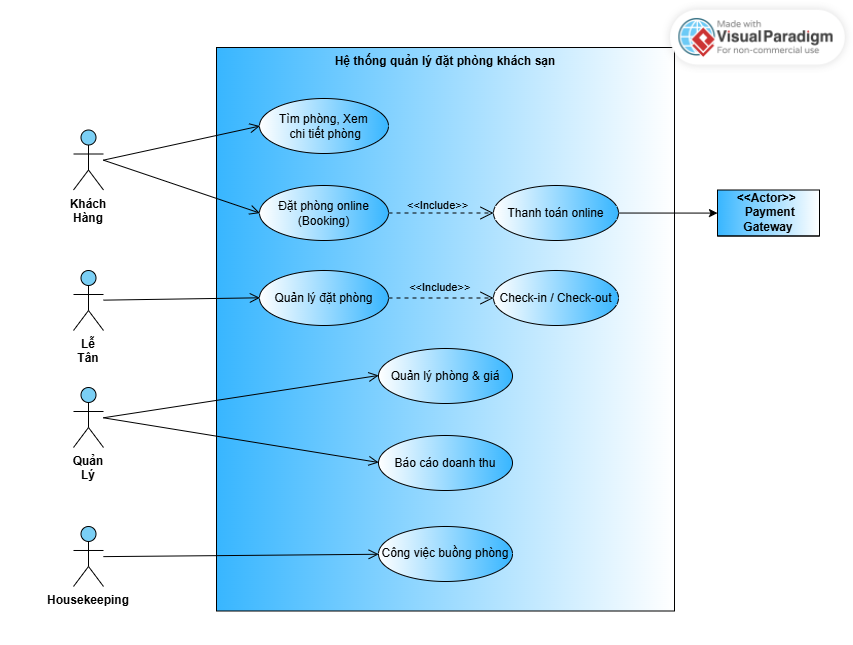
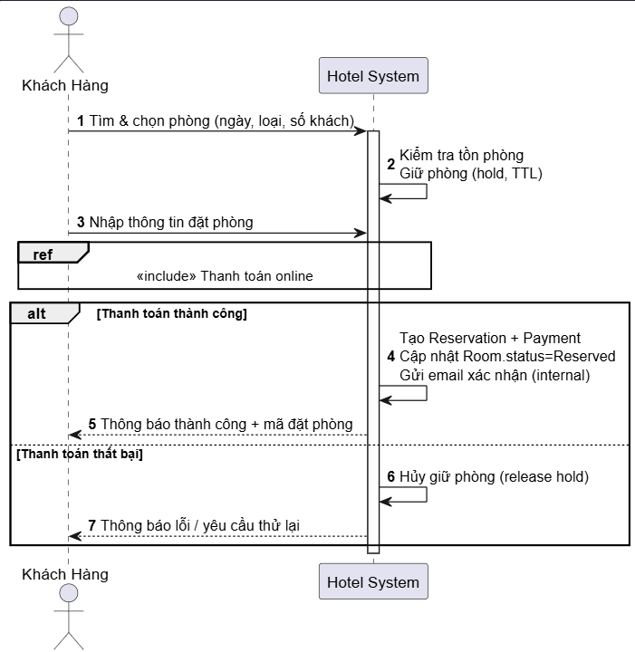
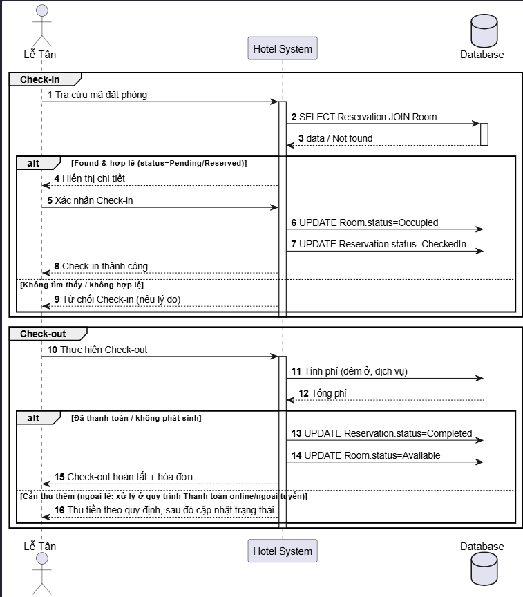
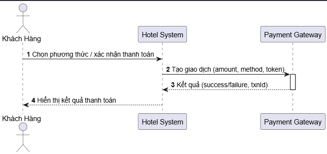
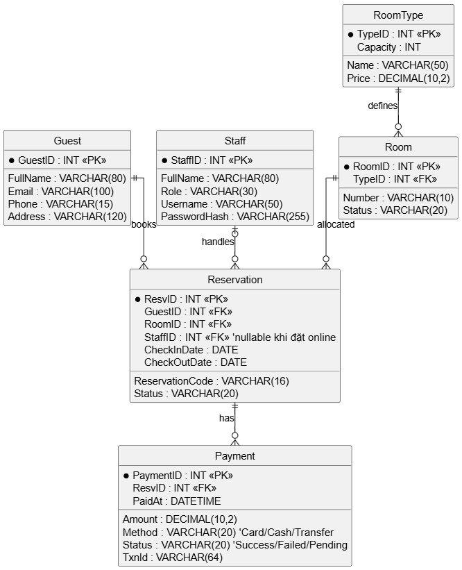

# 🏨 Hotel Booking System – Lab 2 (NMCNPM)

**Sinh viên:** Lâm Thụy Khương — **MSSV:** N23DCCN169
**Trường:** Học viện Công nghệ Bưu chính Viễn thông (PTIT)

## 📖 Giới thiệu

Dự án Lab 2 mô phỏng hệ thống đặt phòng khách sạn: tìm phòng → đặt phòng online → thanh toán → check-in/check-out → quản lý phòng và buồng phòng. Tất cả artefact được lưu dưới dạng **ảnh PNG** trong thư mục `docs/`.

## ⚙️ Chức năng chính

* **Guest (Khách hàng):** tìm phòng, xem chi tiết, đặt phòng online, thanh toán online.
* **Receptionist (Lễ tân):** quản lý đặt phòng, check-in/check-out.
* **Manager (Quản lý):** quản lý phòng & giá, xem báo cáo doanh thu.
* **Housekeeping (Buồng phòng):** nhận công việc dọn phòng sau khi khách check-out.
* **Payment Gateway:** xử lý thanh toán trực tuyến.

## 🖼️ Các sơ đồ UML & ERD  *(PNG trong `docs/`)*

1. **Use Case Diagram**
   

2. **Sequence Diagram – Đặt phòng (Booking)**
   *Flow chính: chọn phòng → **hold** → nhập thông tin → thanh toán → tạo mã đặt phòng / release hold.*
   \n

4. **Sequence Diagram – Check-in/Check-out**
   *Check-in: `Room=Occupied`, `Reservation=CheckedIn` • Check-out: tính phí → cập nhật trạng thái.*
   \n

5. **Sequence Diagram – Thanh toán online** (bổ sung thêm)
   \n

6. **ERD (Entity Relationship Diagram)**
   *Bảng chính: `Guest, Staff, RoomType, Room, Reservation, Payment` • Quan hệ: `Guest 1–n Reservation`, `RoomType 1–n Room`, `Room 1–n Reservation`, `Reservation 0–n Payment`, `Staff 0–n Reservation`.*
   \n

## 🚀 Công cụ sử dụng
- **Jira:** Quản lý Product Backlog, Sprint Planning, Board.  
- **Dbdiagram:** Thiết kế ERD.  
- **MySQL Workbench:** Thiết kế & reverse engineer ERD.  
- **PlantUML / Draw.io:** Vẽ sơ đồ UML.  
- **GitHub:** Lưu trữ và quản lý version của artefact.

## 👨‍💻 Thông tin môn học

* **Môn học:** Nhập môn Công nghệ Phần mềm
* **Bài tập:** Lab 2

---
